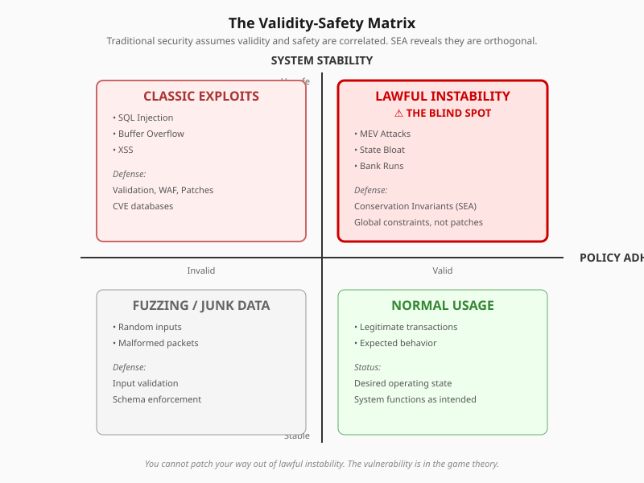

# The Semantics of Collapse: Lawful Instability in Agentic Systems

This repository contains the full documentation and canonical artifact for the working paper:

**The Semantics of Collapse: Lawful Instability in Agentic Systems**  
*A Safe-to-Exist Analysis of Optimization-Driven Systemic Risk*

---

## Summary

This paper identifies a structural blind spot in contemporary security models:  
failure modes in which systems collapse while all actions remain valid, authorized, and policy-compliant.

The work formalizes this failure class as **lawful instability** and demonstrates why detection-based security paradigms are insufficient in agentic environments.

[Read the paper (PDF)](The_Semantics_of_Collapse_Lawful_Instability_in_Agentic_Systems.pdf)

---

## Core Claim

In systems containing autonomous optimizers, lawful instability is not an edge case.  
It is the default equilibrium unless explicitly constrained.

---

## The Problem

Contemporary security frameworks (OWASP, NIST CSF, MITRE ATT&CK) share a common assumption: security failures result from deviation from specified behavior.

These frameworks excel at detecting aberrations:
- Unauthorized access
- Malformed inputs
- Violated policies

However, the emergence of autonomous economic agents introduces a categorically different threat model: systemic instability through strict adherence to permitted behavior.

When rational optimizers interact with systems at computational speed, they exploit not vulnerabilities in the traditional sense, but rather gradient surfaces in business logic, mathematical structures that incentivize behaviors which are individually valid yet collectively catastrophic.

---

## The Validity-Safety Matrix

Traditional security implicitly assumes validity and safety are correlated. SEA reveals they are orthogonal.



<details>
<summary>ASCII version (for plaintext contexts)</summary>

```
                    SYSTEM STABILITY
                          ↑
                        Unsafe
                          │
          ┌───────────────┼───────────────┐
          │               │               │
          │   CLASSIC     │    LAWFUL     │
          │   EXPLOITS    │  INSTABILITY  │
          │               │               │
          │  • SQL Inject │  • MEV Attacks│
          │  • Buffer Ovfl│  • State Bloat│
          │  • XSS        │  • Bank Runs  │
          │               │               │
          │  Defense:     │  Defense:     │
          │  Validation   │  Invariants   │
          │  WAF, Patches │  (SEA)        │
          │               │               │
    ──────┼───────────────┼───────────────┼──────→ POLICY
          │    Invalid    │     Valid     │      ADHERENCE
          │               │               │
          │   FUZZING     │    NORMAL     │
          │   JUNK DATA   │    USAGE      │
          │               │               │
          │  • Random     │  • Legitimate │
          │    inputs     │  transactions │
          │  • Malformed  │  • Expected   │
          │    packets    │    behavior   │
          │               │               │
          └───────────────┼───────────────┘
                          │
                        Stable
                          ↓
```

</details>

**Top-Right Quadrant: The Blind Spot**

Characteristics:
- Authentication succeeds
- Authorization passes
- Schema validation passes
- Rate limits respected
- No CVE applicable
- System collapses anyway

You cannot patch your way out of lawful instability. The vulnerability is not in the code. It is in the game theory.

---

## Contribution

This work introduces:

- **Lawful Instability** as a security-relevant failure mode
- **The Validity-Safety Orthogonality Problem**
- **Safe-to-Exist Analysis (SEA)** as a complementary security primitive
- **Conservation-based global invariants** for agentic systems

The analysis draws from control theory, distributed systems, and algorithmic game theory.

---

## Taxonomy of Lawful Instability

The paper formalizes specific manifestations:

| Attack Class | Mechanism | Empirical Confirmation |
|--------------|-----------|------------------------|
| Hysteresis Exploitation | Temporal lag between observation and reconciliation | Mango Markets ($110M), MEV extraction ($6B+) |
| State-Entropy Expansion | Asymmetric cost of write vs. persistent storage | Ethereum state bloat (100GB+) |
| Incentive Inversion | Exploiting reward systems designed for negative feedback | Sybil attacks, reputation gaming |

Each attack uses only valid, authorized actions. Traditional security tools are structurally blind to them.

---

## Scope

This repository represents independent research.  
It is published as a working paper and does not claim peer review or institutional affiliation.

---

## Repository Contents

- [README.md](README.md) - This document
- [LICENSE](LICENSE) - CC BY 4.0
- [CITATION.cff](CITATION.cff) - Machine-readable citation
- [The_Semantics_of_Collapse_Lawful_Instability_in_Agentic_Systems.pdf](The_Semantics_of_Collapse_Lawful_Instability_in_Agentic_Systems.pdf) - Canonical paper
- [docs/](docs/) - Supporting documentation
  - [abstract.md](docs/abstract.md) - Full abstract
  - [framework-summary.md](docs/framework-summary.md) - SEA framework overview
  - [glossary.md](docs/glossary.md) - Key terms
  - [relationship-to-other-work.md](docs/relationship-to-other-work.md) - Context within broader research

---

## Publication Record

The [December 21, 2025 release record](CHANGELOG.md) lists a submission to HAL Open Science as awaiting moderation. No later moderation outcome is documented in this repository.

GitHub serves as the canonical technical record.

---

## How to Cite

### Preferred Citation (APA)

Kuntz, C. P. (2025). *The Semantics of Collapse: Lawful Instability in Agentic Systems*. Independent Research. https://github.com/ChristopherPatrickKuntz/semantics-of-collapse-lawful-instability

### BibTeX

```bibtex
@article{kuntz2025semantics,
  title={The Semantics of Collapse: Lawful Instability in Agentic Systems},
  author={Kuntz, Christopher Patrick},
  year={2025},
  month={December},
  note={Independent Research, Working Paper},
  url={https://github.com/ChristopherPatrickKuntz/semantics-of-collapse-lawful-instability}
}
```

### Repository Citation

If citing the repository itself:

```
ChristopherPatrickKuntz/semantics-of-collapse-lawful-instability (v1.1)
https://github.com/ChristopherPatrickKuntz/semantics-of-collapse-lawful-instability
```

---

## License

Released under CC BY 4.0.
